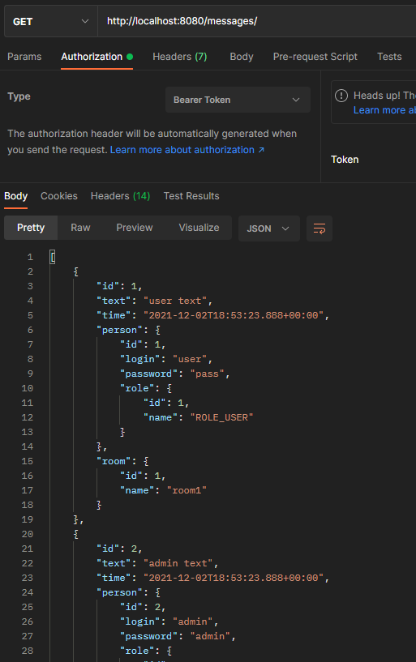

# Проект - Rest
[](https://travis-ci.com/saimon494/job4j_rest)
[](https://codecov.io/gh/saimon494/job4j_rest)

## О проекте

* Данный проект - Spring boot приложение, представляет собой реализацию чата c комнатами.
* Неавторизованные пользователи с приложением работать не могут. Чтобы послать запрос на любой из
  REST-сервисов сначала необходимо пройти авторизацию, в противном случае будет выдана ошибка доступа.
* Авторизация построена на Java JWT. Все зарегистрированные пользователи хранятся в БД.
* Приложение построено на двух слоях: слой по работе с БД и слой контроллеров.
* В качестве БД используется PostgreSQL.
* Работа с БД осуществляется через Spring Data JPA.
* Слой контроллеров использует Spring MVC.
* Все контроллеры построены по REST-архитектуре.
* Осуществлена интеграция REST-сервисов через RestTemplate.
* На все контроллеры написаны тесты с помощью Spring Test, Mockito и JUnit5.
* В качестве БД для тестов используется БД в памяти HSQLDB.
* Во всех контроллерах добавлена валидацию входных данных. 
* Исключения, выбрасываемые в ходе валидации, обрабатываются в классе, помеченным как @ControllerAdvise.
* Для проверки приложения используется Postman.

## Сборка

Для сборки проекта необходимо:
1. Установить JDK 14.
2. Установить Maven.
3. Установить Postman.
4. Установить сервер БД PostgreSQL, задать логин - *postgres*, пароль - *password*.
5. Скачать исходный код проекта. 
6. Создать в pg_Admin БД *chat*.
7. Открыть Query Tool для созданной БД и запустить SQL-скрипт `update_001.sql` из папки `db`.
8. Перейти в корень проекта, где лежит файл `pom.xml`.
9. Собрать проект командой `mvn -DskipTests=true package`.
   При успешной сборке должна появиться папка target c `chat-2.jar`.

## Использование

Запускаем приложение:
```
java -jar chat-2.jar
```
Для проверки работы приложения будем использовать Postman, 
чтобы посылать соответствующие HTTP-запросы на REST-сервисы.  
При попытке получить список всех пользователей получаем ответ со статусом 403, поскольку требуется токен:  
  
Регистрация без тела метода тоже вызовет ошибку:  
  
Корректный запрос на регистрацию и сохранение в БД:    
  
  
Зайдем новым пользователем. Токен располагается в заголовке Authorization:    
  
Теперь можно получить доступ ко всем REST-сервисам приложения, 
указывая в заголовках отправляемых запросов полученный токен.  
Получение всех пользователей:  
  
Получение всех ролей:  
    
Получение всех комнат, обновление названия:       
  
  
Название комнаты поменялось:  
  
Получение списка сообщений:  
  
Получение сообщения по id:   
  
Создание сообщения:  
  
Запрос всех сообщений:    
  
Обновление сообщения:    
  
Обновление текста сообщения:    
  
Удаление сообщения:   
  
Запрос всех сообщений:    
  

## Контакты
[](https://t.me/Saimon494)